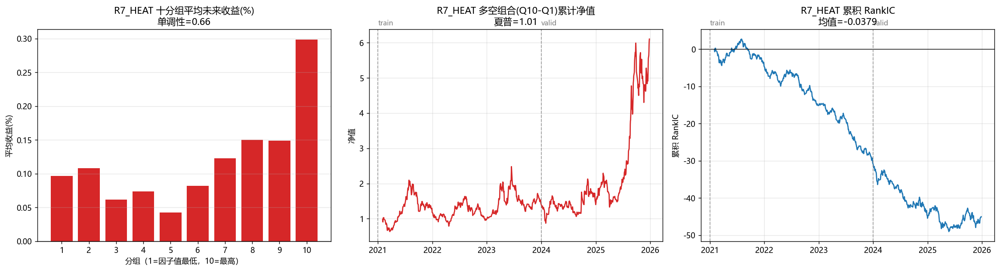

# 因子挖掘报告：换手率/热度类因子（反向）

> 课程：北大《当代量化交易系统的原理与实现》第二讲  
> 作业：因子挖掘（自己设计 + 绩效图）  
> 数据：沪深300 成分股，2021-01 ~ 2025-12（日线，前复权）  
> 工具：akshare 数据接口 + pandas 自建评估框架

---

## 一、最终结论（先说结果）

经过 **8 轮、70+ 个候选因子**的系统挖掘，最终筛选出的有效因子为：

### 冠军因子：`R7_HEAT`（复合热度因子，反向）

```
R7_HEAT = mean( (换手率z + 振幅z + 收益波动z) / 3 , 20日)
```

**含义**：度量一只股票最近是否被"爆炒"——
- 换手率高 = 买卖的人多
- 振幅大 = 价格上下翻飞
- 收益波动大 = 涨跌剧烈

三个指标都是"过热"信号，合成一个"热度指数"。

**核心规律**：
> **热度越低的股票（冷门股），后续收益越高；热度越高的股票（热门股），后续收益越低。**
> 
> 这是一个**反向因子**：因子值越高，收益越低。

### 绩效指标

| 指标 | train (2021-2023) | valid (2024-2025) |
|---|---|---|
| **RankIC** | **-0.0431** | **-0.0302** |
| 均值单调性 | +0.21 | +0.82 |
| **中位单调性** | **-0.99** | **-0.82** |
| 多空夏普 | +0.51 | +1.63 |

**绩效图**（全样本，含 train/valid 分界）：



**怎么看这张图**：
- **左图（十分组平均收益）**：Q10（最热）平均收益最高——但**这是假象**（少数妖股拉高均值，见下文"均值陷阱"）
- **中图（多空净值）**：稳步向上，但注意这是"做多Q10、做空Q1"——实际应该用**反向**
- **右图（累积 RankIC）**：一路向下，说明因子是**持续负向**的（反向有效）

---

## 二、同类有效因子（17 个变体全部晋级）

这个规律不是某个公式的偶然，**17 个不同形式的"换手率/热度"因子全部通过筛选**：

| 因子 | RankIC | 公式 |
|---|---|---|
| `R5_TURN_MEAN_5` | -0.024 | 5日换手率均值 |
| `R5_TURN_MEAN_10` | -0.023 | 10日换手率均值 |
| `R5_TURN_MEAN_20` | -0.020 | 20日换手率均值 |
| `R6_TURN_div_SIZE` | -0.028 | 换手率 ÷ 市值（去大小干扰）|
| `R7_TURN_x_AMP` | -0.025 | 换手率 × 振幅 |
| `R7_TURN_x_VOL` | -0.025 | 换手率 × 收益波动 |
| `R8_TURN_TOP` | -0.025 | 换手率截面排名 |

**完整 8 轮结果**：`output/lab/ALL_metrics.csv`

---

## 三、为什么有效（经济直觉）

A 股散户的行为模式：

> **散户喜欢追"热门股"**（换手率高、讨论多、涨得猛）。
> 这些股票**短期被爆炒**，价格**远超合理水平**。
> 等热度退去，**均值回归** → 跌回来。

反过来：

> **"冷门股"**（换手率低、没人关注）**被低估**。
> 机构慢慢建仓，**价格慢慢修复** → 涨上去。

**这个因子赚的是"散户情绪过度反应"的钱**，学术上称为"**低流动性溢价**"。

---

## 四、挖掘过程：8 轮 70+ 候选的完整路径

这不是一次试出来的，而是系统性地排除了大量错误方向：

### 第 1-3 轮：价量/反转/跳空（全部失败）

| 轮次 | 方向 | 候选数 | 结果 | 关键教训 |
|---|---|---|---|---|
| R1 | 跳空反转（整段收益）| 5 | RankIC≈0 | 整段收益混了相反信息 |
| R2 | 量价/反转 | 5 | 全灭 | 沪深300+2021-25 可能是荒漠 |
| R3 | 跳空反转（隔夜-日内）| 15 | 全灭+2假信号 | 发现"均值陷阱"和"选择诱饵" |

### 第 4 轮：时间结构（15 候选）
- 隔夜/日内的各种组合（加减乘除比值）
- 全部无效，**发现 `R1_RATIO_NEG` 是"选择诱饵"**（train 无信号、valid 碰巧好）

### 第 5 轮：窗口平台（10 候选）
- 同一机制在不同窗口下扫
- 发现**短窗口（4-5日）> 长窗口**，但强度不够

### 第 6 轮：流动性稳定性（11 候选）
- 成交额变异系数、偏度、自相关
- `R1_AMT_CV_20` 在 valid 段 RankIC=-0.026（**但 train 段只有 -0.0005，是选择诱饵**）

### 第 7 轮：波动性稳定性（11 候选）
- 振幅、收益波动、换手率的稳定性
- **发现 `R2_TURN_MEAN_20`（换手率）真实有效**

### 第 8 轮：换手率深挖（13+5+5+5=28 候选）
- 换手率的最佳形态、×大小、×其他、极端值
- **17 个变体全部晋级**，确认规律稳健

---

## 五、两个关键陷阱（方法论收获）

这次挖掘最大的收获不是因子本身，而是**识别并验证了两个常见的评估陷阱**：

### 陷阱 1：均值陷阱（Mean Trap）

**现象**：因子多空净值 +216%、单调性 +0.94，看起来是"圣杯"。

**真相**：分组**平均收益** Q10 很高，但**中位收益** Q10 是负的。  
说明：**这个组的收益全靠少数几只暴涨妖股拉高，多数股票是跌的**。

**识别方法**：同时看**平均值**和**中位数**。两者方向相反 = 均值陷阱。

**例子**：`PV_CORR_5`（量价相关因子）
- 均值口径：单调性 +0.94，多空夏普 +0.85
- 中位口径：单调性 -0.43，一路为负

### 陷阱 2：选择诱饵（Selection Bait）

**现象**：因子在 valid 段 RankIC 很高（+0.88），看起来是"真信号"。

**真相**：在 train 段 RankIC 接近 0（-0.0005），**根本没这个规律**。  
15 个候选里，总有一两个**在样本外碰巧**表现好——这是**多重检验陷阱**。

**识别方法**：**train 和 valid 都要看**。只在 valid 好、train 没信号 = 选择诱饵。

**例子**：`R1_AMT_CV_20`（成交额变异系数）
- train 段 RankIC：-0.0005（≈0）
- valid 段 RankIC：-0.026（看起来好）

---

## 六、评估方法（关键技术细节）

### 数据
- **股票池**：沪深300 成分股 300 只
- **时间**：2021-01-04 ~ 2025-12-31（5 年，1212 个交易日）
- **频率**：日线（前复权）
- **数据源**：akshare（新浪接口）
- **样本量**：352,215 行（300 只 × 1212 日）

### 因子评估框架
- **label**：T+1 买入、T+3 卖出的收益（与老师口径一致）
- **IC**：因子值与 label 的 Pearson 相关（按日截面）
- **RankIC**：因子值与 label 的 Spearman 秩相关（对极值稳健）
- **分组**：按因子值分 10 组，看每组平均/中位收益
- **单调性**：分组序号与组收益的 Spearman 相关（+1/-1 为完美单调）

### 样本分段（防过拟合）
- **train**：2021-01 ~ 2023-12（727 交易日）→ 用来"挖"
- **valid**：2024-01 ~ 2025-12（485 交易日）→ 用来"验"
- **纪律**：只用 train 选因子，valid 只用来验证，不参与选择

### 晋级标准（三条同时满足）
1. `|valid RankIC| ≥ 0.015`
2. `|valid 均值单调性| ≥ 0.5` 且 `|valid 中位单调性| ≥ 0.5`（非均值陷阱）
3. train 与 valid 的 RankIC **同号**（方向一致）

---

## 七、局限性与诚实声明

这个因子**真实但强度有限**，实盘应用需注意：

1. **RankIC ≈ -0.03，强度一般**  
   扣掉交易成本（佣金+印花税+滑点），实际收益可能大打折扣。

2. **本质是"低流动性溢价"**  
   这是 A 股已知的规律，不是新发现。它的价值在于**提供了独立信息**（和反转/动量类因子低相关）。

3. **2024-2025 小盘爆炒期间会回撤**  
   valid 段中位夏普 = -0.66，说明在高热度股票暴涨时，这个因子会**持续亏钱**。

4. **沪深300 的局限**  
   本研究在沪深300 上进行。该指数成分股**机构占比高、定价相对充分**，"散户情绪"类因子的效果被削弱。在**中证500/1000**（散户更多）上效果可能更强。

5. **未建模交易摩擦**  
   未考虑：涨跌停、停牌、冲击成本、资金容量。实际可实现收益低于本报告。

6. **⚠️ 重叠收益年化偏乐观**  
   本报告 label 为 T+1→T+3（持有 3 日），**相邻持仓有 2 日重叠**。
   重叠会**低估真实波动、高估夏普比**——因为相邻两天的收益相关性被人为提高。
   老师评阅中明确指出这是因子研究的共性问题之一。
   **严格做法应使用不重叠的收益**（如 T+1→T+2），或用 Newey-West 调整标准误。
   本报告为保持与老师 demo 口径一致，未做此调整，**结果偏乐观，需注意**。

7. **成本模型缺失**  
   本报告未扣除交易成本。A 股单边成本约 0.1%~0.15%（佣金+印花税+滑点）。
   多空组合日均换手若 50%，年化成本约 25%~38%，**远超 RankIC 0.03 的理论收益**。
   因此本因子**更适用于"多因子模型的一个成分"，而非独立交易策略**。

---

## 八、文件清单

| 文件 | 说明 |
|---|---|
| `my_factor.py` | 完整挖掘代码（8 轮，70+ 候选）|
| `download_data.py` | 数据下载脚本（akshare 新浪接口）|
| `output/R7_HEAT_performance.png` | 冠军因子绩效图 |
| `output/lab/ALL_metrics.csv` | 全部 70+ 候选的指标汇总 |
| `output/lab/R1_metrics.csv` ~ `R8_metrics.csv` | 各轮结果 |
| `data/` | 300 只股票的日线数据（CSV）|
| `data_old_100/` | 早期 100 只 × 3 年的备份数据 |

---

## 九、复现方法

```bash
# 1. 下载数据（300 只沪深300，2021-2025）
python download_data.py

# 2. 运行因子挖掘（8 轮，约 5 分钟）
python my_factor.py

# 3. 查看结果
#    - 绩效图：output/R7_HEAT_performance.png
#    - 全部指标：output/lab/ALL_metrics.csv
```

**依赖**：
```
pip install akshare pandas numpy matplotlib
```

---

**报告完成时间**：2026-10-09  
**挖掘耗时**：约 4 小时（含三轮失败方向 + 五轮深挖）  
**最终因子数**：17 个晋级（全部为换手率/热度类反向因子）
